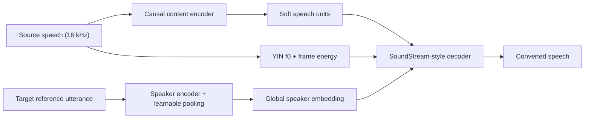
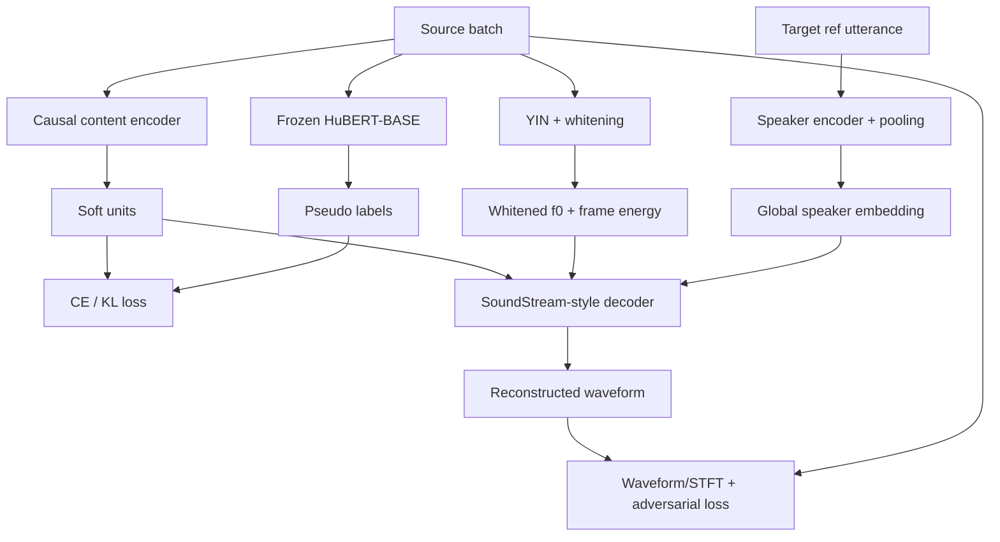

# StreamVC アーキテクチャ概要

## 推論パイプライン（論文記載の事実）



- 推論は 20 ms フレーム／20 ms ホップで実行される。ストリーミング遅延は 3 フレーム (60 ms) のルックアヘッドと Pixel 7 で約 10 ms の計算遅延を合算して約 70 ms。[1][2]
- Content encoder は因果畳み込みで soft speech units を抽出し、学習時のみ線形＋softmax 頭部で HuBERT-BASE ラベルと整合。推論では前段活性のみを Decoder に渡す。[1]
- Target 話者の参照発話を事前処理し、学習可能プーリングで得たグローバル話者埋め込みを推論中は固定で使用する。[1]
- f0 系は YIN を 3 閾値で評価し、得た f0 を発話統計で白色化した上でフレームエネルギとともに Decoder へ供給する。推論時はランニング統計で白色化を更新する。[1][2]
- Decoder は SoundStream 系ボコーダ構造で、soft speech units・whitened f0/energy・speaker 埋め込みを条件として波形を生成する。[2]

## 学習パイプライン（論文記載の事実）



- HuBERT-BASE の疑似ラベルを固定し、content encoder の線形＋softmax 出力との CE/KL 損失を計算する。[1]
- Decoder は SoundStream の学習戦略（多尺度 STFT、波形 L1、GAN/feature 損失）を踏襲し、content/f0/speaker 条件付きで元音声を再構成する。[2]
- f0 は発話単位統計で白色化し、推論時はランニング統計に切り替える。Frame energy も side information として併用する。[1][2]
- Target 話者のグローバル埋め込みは各ミニバッチで一度算出し、Decoder の FiLM 等で条件付けされる。[1]

## 実装検討メモ（仮定・裁量ポイント）

- Content encoder／decoder の層数やチャネル幅、総パラメータ数 (≈20M) 以外の詳細ハイパラは未公開。SoundStream 実装をベースに適宜チューニングする。元ドキュメントに記載した C/D 値は参考候補として扱う。[1]
- YIN から得る付加特徴（信頼度チャネル数やログエネルギなど）の細目は公開されていない。最小構成は「3 閾値の YIN 指標 + 白色化 f0 + フレームエネルギ」。[1]
- RVQ のコードブック数やコミットメント係数なども未公開のため、SoundStream 既存値を起点に実験で決定する。[2]
- 追加検討として、後続バージョンでは f0 の再スケーリングや NSF 由来の調波＋雑音条件付けが有効だったと報告されている。[1]

## 実装アーキテクチャ計画（検証可能性重視）

- **モジュール分割**
  - `ContentEncoder`（因果Conv本体）と `ContentHead`（学習時のみ HuBERT-BASE ラベルに対する CE/KL を計算）。
  - `SpeakerEncoder`＋`LearnablePooling` で参照発話→グローバル埋め込みを取得し、推論中はキャッシュして再利用。
  - `PitchEnergyExtractor` が YIN 計算と白色化統計（学習時=発話統計、推論時=ランニングEMA）を切り替えられるように実装。
  - `StreamVCDecoder`（SoundStream 派生）と `ResidualVectorQuantizer` を独立クラス化し、コードブック数等を設定ファイルで切替。
  - `StreamVCPipeline`（推論）、`StreamVCTrainer`（学習）で各モジュールを組み立て。構成は YAML/TOML など外部設定からロード。

- **検証しやすい構造**
  - 20 ms チャンク処理を統括する `StreamVCPipeline.step(audio_chunk)` を用意し、ルックアヘッド長やバッファサイズを設定ファイルで変更可能に。
  - ユニットテストで因果性チェック（未来フレーム差分に対する感度テスト）を実施。
  - 評価メトリクス（DNSMOS/WER/CER/f0 PCC/レイテンシ）をトレーナ内部で自動記録し、実験ログ（例: W&B, TensorBoard）に送る。

- **トレーニングパイプライン**
  - データセットは HuBERT ラベルと YIN 統計を事前生成・キャッシュし、再学習時の I/O を削減。
- 損失計算は CE/KL + multi-scale STFT + waveform L1 + RVQ を組み合わせ、重みは設定ファイル化。標準ロギングは TensorBoard で行い、損失や評価指標を可視化。
  - RVQ のハイパラ（コードブック数、ベクトル次元、commitment weight）や学習率スケジュールを切り替え可能にし、グリッドサーチを容易化。
  - ストリーミング推論を模した teacher-forced / free-run 推論の比較テストを定期的に挟み、遅延や品質を把握。

- **推論最適化**
  - XNNPACK/TFLite 変換用のエクスポートパスを Pipeline に組み込み、20 ms 周期での計算時間を Pixel 7 実機または同等 SoC エミュレーションでプロファイル。
  - 量子化（INT8/weight quantization）や Conv 縮小で遅延削減を検証できるよう、モジュール単位で `torch.quantization` 互換設計。

## データ戦略（日本語話者対応）

- **採用コーパスの固定方針**
  - 英語ベース学習: `LibriTTS` をメインセットとして用い、`VCTK` をファインチューニング用追加データに指定。
  - 日本語対応: 多話者・話者ID付きの `JVS` を必須とし、必要に応じて JSUT/Voice Actress Corpus など単話者資料は補助用途で使用。
  - `configs/default.yaml` では上記3コーパスをデフォルト設定として明文化。小規模検証はこれらから話者数・発話数を絞ったサブセットで実施し、本番運用時はフルセットに切り替える。
- HuBERT-BASE ラベル生成と YIN 統計キャッシュは各データセットに対して同一手順で前処理し、`data/cache/<dataset>/` 以下に保存。
- 日本語のモーラタイミング・ピッチレンジに合わせ、f0 白色化統計が偏らないかを監視し、必要に応じて言語別EMAを導入。
- サンプリングウェイトやミニバッチ構成で日英比率を設定できるようにし、日本語話者の更新頻度を保証。
- 評価セットには日本語音声を含め、日本語 ASR（例: Whisper large-v2 JP）で CER/WER を算出。日本語ターゲット話者の参照発話も確保し、Speaker Encoder の埋め込みが多言語話者で安定するか確認。

## データセット取得・キャッシュ生成手順

1. **環境準備**
   ```bash
   cd /Users/akatuki/streamVC
   uv venv
   source .venv/bin/activate        # Windows は .venv\Scripts\Activate.ps1
   uv pip install -r requirements.txt
   ```

2. **HuBERT / K-means モデル配置** (`data/cache/hubert/`)
   ```bash
   mkdir -p data/cache/hubert
   cd data/cache/hubert
   curl -L -o hubert-base-ls960.pt https://huggingface.co/facebook/hubert-base-ls960/resolve/main/hubert-base-ls960.pt
   curl -L -o km100.joblib         https://huggingface.co/facebook/hubert-base-ls960/resolve/main/kmeans/km100.joblib
   ```

3. **コーパス展開**
   - LibriTTS: `train-other-500` 等を `data/libritts/` に展開。
   - VCTK: `data/vctk/` に VCTK-Corpus-0.92 を展開。
   - JVS: `data/jvs/` に jvs_corpus を展開。必要に応じて JSUT/Voice Actress Corpus も `data/<name>/` に配置。

   例（LibriTTS）:
   ```bash
   mkdir -p data/libritts
   cd data/libritts
   curl -L -o train-other-500.tar.gz https://www.openslr.org/resources/60/train-other-500.tar.gz
   tar -xzf train-other-500.tar.gz
   ```

4. **メタデータ生成 (`metadata.jsonl`)**
   - 各コーパスごとに `configs/default.yaml` の `metadata` パスへ JSON Lines を作成。
   - 最小構成例（LibriTTS）:
     ```python
     import json
     from pathlib import Path

     root = Path("data/libritts/train-other-500")
     out = Path("data/libritts/metadata.jsonl")
     with out.open("w", encoding="utf-8") as f:
         for speaker in sorted(root.glob("*/")):
             wavs = sorted(speaker.rglob("*.wav"))[:20]  # 小規模検証向けに制限
             for i, wav in enumerate(wavs):
                 ref = wavs[(i + 1) % len(wavs)]
                 entry = {
                     "id": f"{speaker.name}_{wav.stem}",
                     "split": "train",
                     "source": str(wav.relative_to(root)),
                     "reference": str(ref.relative_to(root)),
                 }
                 f.write(json.dumps(entry) + "\n")
     ```
   - 検証用は `split` を `valid` に変更して別ファイルに保存。

5. **特徴キャッシュ生成**
   ```bash
   python - <<'PY'
   import torch
   from pathlib import Path
   from streamvc.config import load_config
   from streamvc.data.preprocess import preprocess_metadata

   config = load_config("configs/default.yaml")
   device = "cuda" if torch.cuda.is_available() else "cpu"

   for ds in config.data.datasets:
       preprocess_metadata(
           metadata_path=Path(ds["metadata"]),
           cache_dir=Path(config.data.cache_dir),
           dataset_root=Path(ds["root"]),
           dataset_name=ds["name"],
           sample_rate=config.data.sample_rate,
           sample_length_sec=config.data.sample_length_sec,
           reference_length_sec=config.data.reference_length_sec,
           kmeans_path=Path(config.data.hubert_cache) / "km100.joblib",
           device=device,
           split_filter=None,
       )
   PY
   ```

6. **ミニラン実行**（まずはサブセットで）
   ```bash
   python scripts/train.py --config configs/default.yaml --eval
   tensorboard --logdir runs/streamvc_base/logs
   ```

7. **本番スケール**
   - メタデータをフルセットに切り替え、`num_steps` や `batch_size` を引き上げて再学習。
   - 日本語 ASR（Whisper など）で CER/WER を測定し、JVS 追加の効果を評価。

## 実装ロードマップ

1. **セットアップとコンフィグ基盤**
   - 依存ライブラリ（PyTorch、torchaudio、YIN実装、評価系）環境構築。
   - `config/` 以下に YAML テンプレート（モジュール設定、学習設定、データ設定）を作成し、ロード用ユーティリティを実装。
2. **前処理パイプライン**
   - LibriTTS/VCTK/JVS などから 16 kHz wav を統一取得。発話メタ情報（話者ID、言語タグ）を正規化。
   - HuBERT-BASE 疑似ラベル生成バッチと YIN 統計生成スクリプトを実装し、キャッシュフォーマット（例: NPZ/Parquet）を定義。
3. **コアモジュール実装**
   - `ContentEncoder`＋`ContentHead`、`SpeakerEncoder`＋`LearnablePooling`、`PitchEnergyExtractor`（統計管理含む）を実装し、ユニットテストで入出力形状と因果性を確認。
   - `StreamVCDecoder`＋`ResidualVectorQuantizer` を実装し、SoundStream 既存実装との互換テストを行う。[2]
4. **学習フレームワーク構築**
   - `StreamVCTrainer` を作成し、損失計算（CE/KL、STFT、L1、RVQ）と評価メトリクス収集を実装。GAN判別器は未実装のため、導入する場合は multi-scale discriminator を別途追加し、Generator/Discriminator の更新・ログ出力を拡張する。
   - 既知ベースライン（論文設定）で小規模トレーニングを走らせ、損失収束・メトリクスが妥当か確認。[1][2]
5. **ストリーミング推論パイプライン**
   - `StreamVCPipeline` を実装し、20 ms チャンク処理・ルックアヘッド管理・Pixel 7 相当プロフィールを測定。
   - TFLite/XNNPACK 変換を試し、遅延計測と品質評価を行う。[1]
6. **多言語対応と評価**
   - 日本語コーパスを組み込んだファインチューニング手順を確立し、日英混在の評価セットで DNSMOS / CER / WER / f0 PCC を測定。
   - 必要に応じて統計の言語別切替や追加正則化を検討。
7. **最適化と改良検討**
   - RVQ設定、量子化、NSF-style 拡張、GAN判別器導入時の学習安定化などを実験し、指標と遅延を基準に採否を判断。[1]

---

[1]: https://google-research.github.io/seanet/stream_vc/poster/streamvc_poster.pdf
[2]: https://arxiv.org/abs/2401.03078

